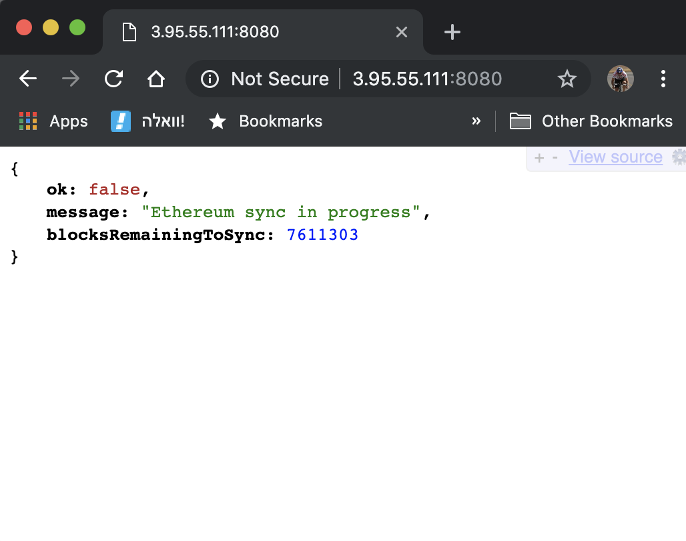

# Ethereum Node with Terraform

The project will help you setup a Parity Ethereum node on top AWS with including a simple but yet effective health check HTTP route.

## What will you need?

Want to get going? No problem! these are the basic requirements to make this project work for you:

* Mac or any kind of Linux on your Lappy would be great
* a standard SSH key pair available at `~/.ssh/id_rsa` private key and it's accompanying public key at `~/.ssh/id_rsa.pub`. If you don't have such a key you can generate one using [these instructions](https://confluence.atlassian.com/bitbucketserver/creating-ssh-keys-776639788.html)
* You should have access to an active AWS account [Instructions](https://docs.aws.amazon.com/IAM/latest/UserGuide/id_users_create.html) 
(Make sure you don't create a console user, but a programmatic one!)
* AWS API User (AccessKey + SecretKey) with enough EC2 permissions to create the resources in this project
* AWS CLI should be installed on your machine [Instructions](https://docs.aws.amazon.com/cli/latest/userguide/cli-chap-install.html)
* AWS Profile setup configured to use the AWS keys for the aformentioned AWS user in the previous bullet. [Instructions](https://docs.aws.amazon.com/cli/latest/userguide/cli-configure-files.html)
* Install Terraform using the following commands in Linux (Ubuntu for example):

    ```sudo apt-get install -y unzip python-dev
    wget https://releases.hashicorp.com/terraform/0.11.10/terraform_0.11.10_linux_amd64.zip
    unzip terraform_0.11.10_linux_amd64.zip
    sudo mv terraform /usr/local/bin/
    terraform --version
    ```
    or if you have a Mac:

    ```
    brew install terraform
    ```

## Creating the ethereum node

Once you have all the dependencies in place, open up your terminal and type the following within the project's root folder:

    terraform apply -var aws_profile=default -var region=eu-central-1

This command will calculate what is needed to create your ethereum node and will display a summary of how many resources will be created in your Amazon account for the purpose of setting up this node. you will of course then be prompted if to continue or not. if everything looks good to you, type in `yes` to continue.

Your terminal will output a lot of information regarding the resources while they are being provisioned, once this process completes your Ethereum node should be up and will start syncing automatically.

The end of the output from this command should look similar to the following:

```
aws_volume_attachment.ethereum_block_storage_attachment: Creating...
  device_name: "" => "/dev/sdh"
  instance_id: "" => "i-0f00561a02b647e14"
  volume_id:   "" => "vol-050f999dc4815d4c8"
aws_volume_attachment.ethereum_block_storage_attachment: Still creating... (10s elapsed)
aws_volume_attachment.ethereum_block_storage_attachment: Still creating... (20s elapsed)
aws_volume_attachment.ethereum_block_storage_attachment: Creation complete after 24s (ID: vai-2775455672)

Apply complete! Resources: 21 added, 0 changed, 0 destroyed.

Outputs:

ethereum.public_ip = [
    18.123.321.5
]
```

This instance can be accessed using `ssh` using the provided IP and using the default `ubuntu` user shall you wish to access the machine to update packages and perform regular maintenance or harden the instance security wise.

SSH access is done using:

    ssh ubuntu@18.123.321.5

However, in order to understand the sync state of ethereum there is no need to `ssh` into the machine.

I have built a simple (yet effective) healtcheck available easily using your browser. Simply navigate your browser to the instance IP at port `8080` and you will receive back a very easy to understand `JSON` object stating the state of your ethereum node.

If the JSON contains the property `ok: true` it means the ethereum node has finished syncing (I have attached an easy text in english that explains when the node is synced, still syncing, etc...)

Here's an example of how that would look like
(I'm using a JSON beautifier plugin for Google Chrome that makes JSONs look much better, [click here](https://chrome.google.com/webstore/detail/jsonview/chklaanhfefbnpoihckbnefhakgolnmc?hl=en) to download it if you feel it's useful for you)



Once the node is synced you can of course start performing requests against it on the default `8545` RPC port.

Enjoy!

This project is developed and maintained by @itamararjuan 
Feel free to contribute, PRs are always welcome!

If you find any issues, please open an issue and try to supply a log of your command and a basic outlook at which system you're using and which variables or alterations have you ran your this project with.